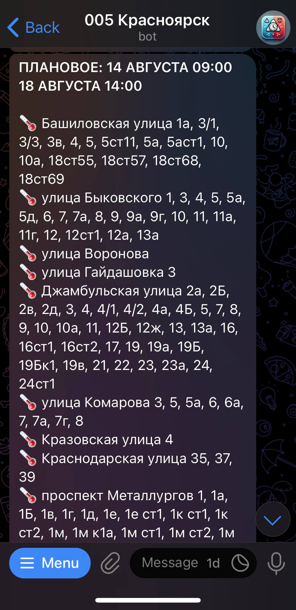

<a id="readme-top"></a>

<!-- PROJECT SHIELDS -->
[![Contributors][contributors-shield]][contributors-url]
[![Forks][forks-shield]][forks-url]
[![Stargazers][stars-shield]][stars-url]
[![Issues][issues-shield]][issues-url]
[![Apache 2.0 License][license-shield]][license-url]

<!-- PROJECT LOGO -->
<br />
<div align="center">
  <a href="https://github.com/005-bot/tg-bot/tree/master">
    
  </a>

  <h3 align="center">005 Бот - Telegram-бот</h3>

  <p align="center">
    Неофициальный Telegram-бот для уведомления жителей города Красноярска об аварийных и плановых отключениях коммунальных услуг.
    <br />
    <br />
    <a href="https://github.com/005-bot/tg-bot/issues/new?labels=bug">Сообщить о проблеме</a>
    &middot;
    <a href="https://github.com/005-bot/tg-bot/issues/new?labels=enhancement">Предложить функцию</a>
  </p>
</div>

<!-- TABLE OF CONTENTS -->
- [О проекте](#о-проекте)
  - [Технологии](#технологии)
- [Начало работы](#начало-работы)
  - [Предварительные требования](#предварительные-требования)
  - [Установка](#установка)
  - [Настройка](#настройка)
  - [Запуск](#запуск)
- [Использование](#использование)
  - [Пример работы](#пример-работы)
- [Дорожная карта](#дорожная-карта)
- [Лицензия](#лицензия)
- [Контакты](#контакты)
- [Благодарности](#благодарности)


<!-- ABOUT THE PROJECT -->
## О проекте

<div align="center">

</div>

Telegram-бот предоставляет жителям города Красноярска возможность оперативно получать информацию о плановых и реальных отключениях коммунальных услуг на основе информации от [Диспетчерской Службы 005](https://005красноярск.рф).

Основные возможности:

- Уведомления в реальном времени через Telegram
- Управление подписками пользователей на конкретные улицы
- Система обратной связи с администратором
- Внутренний обмен сообщениями и управление сессиями пользователей с использованием Redis
- Использование Docker для упрощения развертывания и поддержки

<p align="right">(<a href="#readme-top">в начало</a>)</p>

### Технологии

- [![Python][Python]][Python-url]
- [![Docker][Docker]][Docker-url]
- [![Pipenv][Pipenv]][Pipenv-url]
- [![aiogram][aiogram]][aiogram-url]
- [![Redis][Redis]][Redis-url]

<p align="right">(<a href="#readme-top">в начало</a>)</p>

<!-- GETTING STARTED -->
## Начало работы

Данный раздел содержит инструкции по локальному запуску бота.

### Предварительные требования

Перед запуском бота Вам необходимо:

- Установить Pipenv
- Получить токен для бота от [@BotFather](https://t.me/BotFather)

### Установка

1. Клонируйте репозиторий:
    ```bash
    git clone https://github.com/005-bot/tg-bot.git
    cd tg-bot
    ```

2. Установите зависимости:
    ```bash
    pipenv install
    ```

3. Создайте файл `.env` на основе примера:
    ```bash
    cp .env.example .env
    ```

4. Заполните обязательные настройки в `.env`:
    ```env
    TELEGRAM__TOKEN=ваш_токен_бота
    ```

### Настройка

Основные настройки через переменные окружения:

| Переменная              | Описание                              | По умолчанию             |
| ----------------------- | ------------------------------------- | ------------------------ |
| `REDIS__URL`            | URL Redis сервера                     | `redis://localhost:6379` |
| `REDIS__PREFIX`         | Префикс ключей Redis                  | `bot-005`                |
| `TELEGRAM__TOKEN`       | Токен Telegram бота (обязательно)     |                          |
| `HTTP__HOST`            | Хост веб-сервера (для webhook режима) | `0.0.0.0`                |
| `HTTP__PORT`            | Порт веб-сервера (для webhook режима) | `8000`                   |
| `HTTP__WEBHOOK_PATH`    | Путь для webhook                      |                          |
| `TELEGRAM__WEBHOOK_URL` | Полный URL для webhook                |                          |
| `ADMIN__TELEGRAM_ID`    | ID администратора для уведомлений     |                          |

### Запуск

```bash
pipenv run python -m app
```

<p align="right">(<a href="#readme-top">в начало</a>)</p>

<!-- USAGE EXAMPLES -->
## Использование

После запуска бота пользователи могут взаимодействовать с ним в Telegram. Доступны следующие команды:

- `/start` - Подписаться на уведомления 🔔
- `/stop` - Отписаться от уведомлений 🔕
- `/filter` - Настроить фильтр по улице 🏘️
- `/feedback` - Отправить отзыв 💬
- `/help` - Показать справку ❓

Бот автоматически отправляет уведомления об отключениях на основании информации от [сервиса мониторинга](https://github.com/005-bot/monitor).

### Пример работы

1. Пользователь отправляет `/start`
2. Бот приветствует пользователя и подписывает его на уведомления
3. При получении информации об отключении:
   - Бот проверяет фильтры пользователя
   - Бот форматирует сообщение с emoji по типу ресурса:
     - ⚡️ Электричество
     - 🔥 Газ
     - 💧 Холодная вода
     - 🌡️ Горячая вода
   - Бот отправляет персонализированное уведомление

<p align="right">(<a href="#readme-top">в начало</a>)</p>

<!-- ROADMAP -->
## Дорожная карта

- [x] Базовые возможности
- [x] Управление подписками по улицам
- [x] Redis для управления сессиями и профилями
- [x] Контейнеризация
- [ ] Расширенные возможности подписки (по району, конкретному дому)
- [ ] Аналитика и статистика

<p align="right">(<a href="#readme-top">в начало</a>)</p>

<!-- LICENSE -->
## Лицензия

Приложение распространяется под лицензией Apache-2.0. Подробнее в файле [LICENSE](LICENSE).

<p align="right">(<a href="#readme-top">в начало</a>)</p>

<!-- CONTACT -->
## Контакты

Электронная почта: [help@005бот.рф](mailto:help@005бот.рф)  
Сайт: [005бот.рф](https://005бот.рф)

<p align="right">(<a href="#readme-top">в начало</a>)</p>

<!-- ACKNOWLEDGMENTS -->
## Благодарности

- [aiogram](https://docs.aiogram.dev/) - Современный и полностью асинхронный фреймворк для разработки Telegram-ботов
- [Docker](https://www.docker.com/) - Платформа для контейнеризации
- [Redis](https://redis.io/) - База данных ключ-значение с расширенными возможностями
- [Pipenv](https://pipenv.pypa.io/) - Менеджер зависимостей

<p align="right">(<a href="#readme-top">в начало</a>)</p>

<!-- MARKDOWN LINKS & IMAGES -->
<!-- https://www.markdownguide.org/basic-syntax/#reference-style-links -->
[contributors-shield]: https://img.shields.io/github/contributors/005-bot/tg-bot.svg?style=for-the-badge
[contributors-url]: https://github.com/005-bot/tg-bot/graphs/contributors
[forks-shield]: https://img.shields.io/github/forks/005-bot/tg-bot.svg?style=for-the-badge
[forks-url]: https://github.com/005-bot/tg-bot/network/members
[stars-shield]: https://img.shields.io/github/stars/005-bot/tg-bot.svg?style=for-the-badge
[stars-url]: https://github.com/005-bot/tg-bot/stargazers
[issues-shield]: https://img.shields.io/github/issues/005-bot/tg-bot.svg?style=for-the-badge
[issues-url]: https://github.com/005-bot/tg-bot/issues
[license-shield]: https://img.shields.io/github/license/005-bot/tg-bot.svg?style=for-the-badge
[license-url]: https://github.com/005-bot/tg-bot/blob/master/LICENSE
[Python]: https://img.shields.io/badge/python-3670A0?style=for-the-badge&logo=python&logoColor=ffdd54
[Python-url]: https://python.org/
[Docker]: https://img.shields.io/badge/docker-%230db7ed.svg?style=for-the-badge&logo=docker&logoColor=white
[Docker-url]: https://docker.com/
[Pipenv]: https://img.shields.io/badge/pipenv-%23000000.svg?style=for-the-badge&logo=pipenv&logoColor=white
[Pipenv-url]: https://pipenv.pypa.io/
[aiogram]: https://img.shields.io/badge/aiogram-2B2E4A?style=for-the-badge&logo=telegram&logoColor=white
[aiogram-url]: https://docs.aiogram.dev/
[Redis]: https://img.shields.io/badge/redis-%23000000.svg?style=for-the-badge&logo=redis&logoColor=white
[Redis-url]: https://redis.io/
