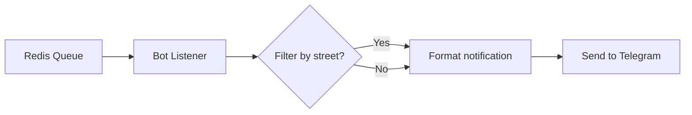

# 005 Бот - Telegram-бот

[](https://opensource.org/licenses/Apache-2.0)

Сервис осуществляет взаимодействие с пользователями в Telegram и отправляет уведомления об отключениях, полученные через очередь сообщений. Дополнительно позволяет фильтровать уведомления по наименованию улицы.

Проект находится на стадии MVP и может содержать обратно несовместимые изменения.

## Содержание
- [005 Бот - Telegram-бот](#005-бот---telegram-бот)
  - [Содержание](#содержание)
  - [О проекте](#о-проекте)
  - [Технологии](#технологии)
  - [Начало работы](#начало-работы)
    - [Предварительные требования](#предварительные-требования)
    - [Установка](#установка)
  - [Настройка](#настройка)
  - [Использование](#использование)
    - [Запуск](#запуск)
    - [Команды бота](#команды-бота)
    - [Пример работы](#пример-работы)
  - [Архитектура](#архитектура)
  - [Дорожная карта](#дорожная-карта)
  - [Лицензия](#лицензия)


## О проекте

Telegram-бот для уведомления пользователей об отключениях коммунальных услуг в Красноярске. Особенности:

- Получение уведомлений через Redis pub/sub
- Фильтрация по улицам с использованием парсера адресов
- Поддержка двух режимов работы: polling и webhook
- Форматирование сообщений с emoji и Markdown
- Локализация на русский язык

Источник информации об отключениях: [https://005красноярск.рф](https://005красноярск.рф)

## Технологии

- [Python](https://www.python.org/)
- [Docker](https://www.docker.com/)
- [Pipenv](https://github.com/pypa/pipenv)
- [Redis](https://redis.io/)
- [aiogram](https://github.com/aiogram/aiogram)
- [pydantic](https://github.com/pydantic/pydantic)

## Начало работы

### Предварительные требования

- Python 3.11+
- Redis 7.0+
- Telegram bot token от [@BotFather](https://t.me/BotFather)

### Установка

1. Клонировать репозиторий:
```bash
git clone https://github.com/005-bot/tg-bot.git
cd tg-bot
```

2. Установить зависимости:
```bash
pipenv install
```

3. Создать файл `.env` на основе примера:
```bash
cp .env.example .env
```

4. Заполнить обязательные настройки в `.env`:
```env
TELEGRAM__TOKEN=ваш_токен_бота
```

## Настройка

Основные настройки через переменные окружения:

| Переменная              | Описание                              | По умолчанию             |
| ----------------------- | ------------------------------------- | ------------------------ |
| `REDIS__URL`            | URL Redis сервера                     | `redis://localhost:6379` |
| `REDIS__PREFIX`         | Префикс ключей Redis                  | `bot-005`                |
| `TELEGRAM__TOKEN`       | Токен Telegram бота (обязательно)     |                          |
| `HTTP__HOST`            | Хост веб-сервера (для webhook режима) | `0.0.0.0`                |
| `HTTP__PORT`            | Порт веб-сервера (для webhook режима) | `8000`                   |
| `HTTP__WEBHOOK_PATH`    | Путь для webhook                      |                          |
| `TELEGRAM__WEBHOOK_URL` | Полный URL для webhook                |                          |
| `ADMIN__TELEGRAM_ID`    | ID администратора для уведомлений     |                          |

## Использование

### Запуск

```bash
pipenv run python -m app
```

### Команды бота

- `/start` - Подписаться на уведомления 🔔
- `/stop` - Отписаться от уведомлений 🔕
- `/filter` - Настроить фильтр по улице 🏘️
- `/feedback` - Отправить отзыв 💬
- `/help` - Показать справку ❓

### Пример работы

1. Пользователь отправляет `/start`
2. Бот приветствует пользователя и подписывает его на уведомления
3. При получении информации об отключении:
   - Бот проверяет фильтры пользователя
   - Бот форматирует сообщение с emoji по типу ресурса:
     - ⚡️ Электричество
     - 🔥 Газ
     - 💧 Холодная вода
     - 🌡️ Горячая вода
   - Бот отправляет персонализированное уведомление

## Архитектура



Ключевые компоненты:

- `app/services/listener.py` - Слушатель очереди Redis
- `app/services/storage.py` - Управление подписками в Redis
- `app/handlers/` - Обработчики команд Telegram
- `app/config/config.py` - Конфигурация приложения

## Дорожная карта

- [ ] Добавить поддержку уведомлений по районам
- [ ] Реализовать веб-интерфейс управления

## Лицензия

Распространяется под лицензией Apache 2.0. Подробнее в файле [LICENSE](LICENSE).
